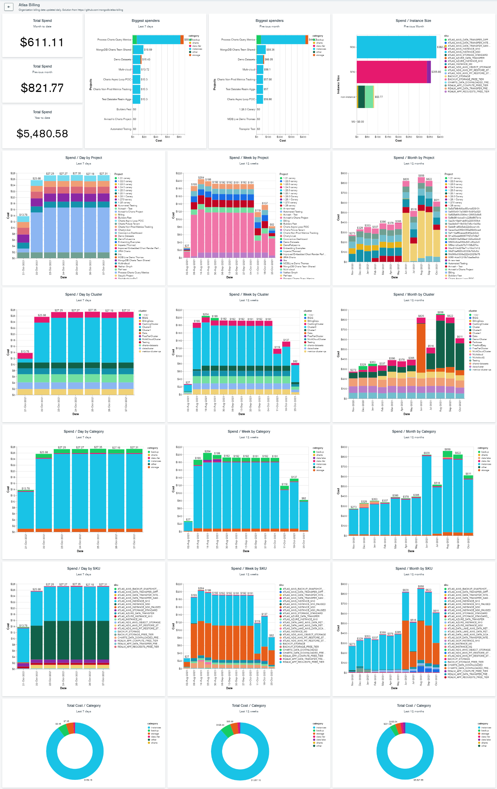

# MongoDB Atlas Billing Exploration using Charts

This project enables you to build your own automated MongoDB Atlas Billing Dashboard. It includes a MongoDB Realm application which regularly imports data from the Atlas Billing API into your own Atlas cluster. It also includes a MongoDB Charts dashboard with visualizations of your billing data, which you can use as-is or extend to give you detailed insights into your Atlas usage.

*Jump to [setup instructions](#setup).* 



# Video
[](https://www.youtube.com/watch?v=1sD0MBuGecQ)

# Setup
Setting up this solution involves a number of steps in the Atlas web portal,
followed by some command line scripts to be run locally. Finally you will
open MongoDB Charts to import the dashboard.

## Atlas Portal Steps
1. Sign into [MongoDB Atlas](https://cloud.mongodb.com)
2. Create a new Project within the Atlas Organization which you wish to analyze
billing data for. Give the project a descriptive name such as `Atlas Billing`. 
3. Deploy a new cluster in this project to store your billing data. The free
tier (M0) should be sufficient to get started. Give your cluster a descriptive 
name such as `billing-data`.
4. Create an API Key for the project. This will be used to programmatically
deploy the Realm app:
    * Ensure that `Atlas Billing` is your active project
    * Click **Access Manager** on the top bar, and then **Project Access**
    * Click **Create API Key**
    * Enter an appropriate name for the key, e.g. `Billing App Deployment`
    * Select the  `Project Owner` role.
    * Click **Next**
    * Record the Public and Private Key details and store them securely.
    * Click **Done** when you're ready to save the new key to your Project
5. Create an API Key for the Organization. This will be used to authenticate
to the Billing API:
    * Ensure that `Atlas Billing` is your active project
    * Click **Access Manager** on the top bar, and then **Organization Access**
    * Click **Create API Key**
    * Enter an appropriate name for the key, e.g. `Billing API Access`
    * Select the `Organization Billing Admin` and `Organization Read Only` roles.
    * Click **Next**
    * Record the Public and Private Key details and store them securely.
    * Click **Done** when you're ready to save the new key to your Organization.
## Local Command Line Steps
1. Install the following prerequisites on your computer if they aren't already
present:
    * [Git](https://git-scm.com/downloads)
    * [Node.js](https://nodejs.org/en/download/)
    * [MongoDB Realm CLI](https://docs.mongodb.com/realm/cli/)
2. Clone this repo to an appropriate directory on your computer:
    ```
    git clone https://github.com/mongodb/atlas-billing.git
    ```
3. Change directory to the cloned project:
    ```
    cd atlas-billing
    ```
4. Run the setup script
    
    *Using Powershell*:
    ```
    ./setupBillingRealmApp.ps1
    ```

    *Using bash*:
    ```
    ./setupBillingRealmApp.sh
    ```
5. When prompted, enter the public and private API keys for your Organization
and Project, as well as the name of your cluster.
6. Wait for the script to complete, and then verify that data has been loaded into your cluster.
Note that the app contains a trigger which will load new data into the cluster daily.

## Charts Steps
1. Sign into [MongoDB Atlas](https://cloud.mongodb.com) and select your `Atlas
Billing` project
2. Click the **Charts** tab on the top nav, and activate Charts if you haven't done so already
3. Click the **Data Sources** option on the left nav, and choose 
**Add Data Source**
4. Select your `billing-data` cluster, and add data sources for all collections
in the `billing` database, followed by **Finish**
5. Click the **Dashboards** option on the left nav
6. Find the **Add Dashboard** button and click the down arrow, and then select
**Import Dashboard**
7. Choose the `charts_billing_template.charts` file from this repo, click **Next**
and then **Save**
8. Open the imported dashboard, and start exploring your Atlas usage and billing data! You
may want to try changing the dashboard filters, editing existing charts or adding new charts.


# Solution Details
The Realm app in this repo contains one function, one trigger and some values & secrets. You
can view and update the deployed app by clicking the **Realm** tab on the top Atlas nav.

### Functions
`getdata`: this function retrieves all invoice data related to a specific organization.

`processdata`: this function updates data and has additional categorization of the data to enhance the output in MongoDB Charts.

`getall`: this function calls the getdata function for each organization. It can be updated to implement cross-organization billing.

`processall`: this function calls the processdata function for each organization. It can be updated to implement cross-organization billing.

### Values & Secrets
`billing-org`: maps to the Org Id we want to gather Billing data from. `Maps to billing-orgSecret`.

`billing-username`: maps to the Public API key for the Org we want to gather Billing data from. Maps to `billing-usernameSecret`.

`billing-password`: maps to the Private API key for the Org we want to gather Billing data from. Maps to `billing-passwordSecret`.

### Triggers
`getAllTrigger`: runs at 7am GMT each morning to retrieve the billing data using the `getall` function above.

`processAllTrigger`: runs at 7:30am GMT each morning to update the billing data using the `processall` function above.
 
# Enhancements
Additional enhancements are possible such as:
Extend the Billing code to retrieve data from multiple MongoDB Atlas Orgs. Currently, this can be done manually by creating another set of values and secrets for the second organisation and updating the `getall` and `processall` functions. 
For example, you can update `getall` as follow to add another organisation:

```
exports = async function(){
  console.log(`refreshInvoiceData: ` + (context.values.get(`refreshInvoiceData`)));
  console.log(`refreshOrgData: ` + (context.values.get(`refreshOrgData`)));
  console.log(`refreshProjectData: ` + (context.values.get(`refreshProjectData`)));
  const promises = [
   
    context.functions.execute("getdata_latest", context.values.get("billing-org"), context.values.get("billing-username"), context.values.get("billing-password"))
      .catch(err => { return err; }),
    context.functions.execute("getdata_latest", context.values.get("SECOND-ORG-ID-VALUE"), context.values.get("SECOND-PUBLIC-API-VALUE"), context.values.get("SECOND-PRIVATE-API-VALUE"))
      .catch(err => { return err; }),
    
  ];
  const results = await Promise.all(promises);
  return {"status": "complete!", "results": results };
};
```


# Documentation Links
* [Realm CLI](https://docs.mongodb.com/realm/deploy/realm-cli-reference/)
* [MongoDB Atlas](https://www.mongodb.com/cloud/atlas)
* [MongoDB Charts](https://docs.mongodb.com/charts/master/)
* [Values & Secrets](https://docs.mongodb.com/realm/values-and-secrets/)
* [MongoDB API Resources](https://docs.atlas.mongodb.com/reference/api-resources/)
* [Tracking and Managing Your Spend on MongoDB Atlas](https://www.youtube.com/watch?v=qP-n8wnwZzI)
* [Building a MongoDB Billing Dashboard](https://www.mongodb.com/blog/post/building-a-mongodb-billing-dashboard--part-2)
* [MongoDB University: Introduction to MongoDB Charts](https://university.mongodb.com/courses/A131/about)


